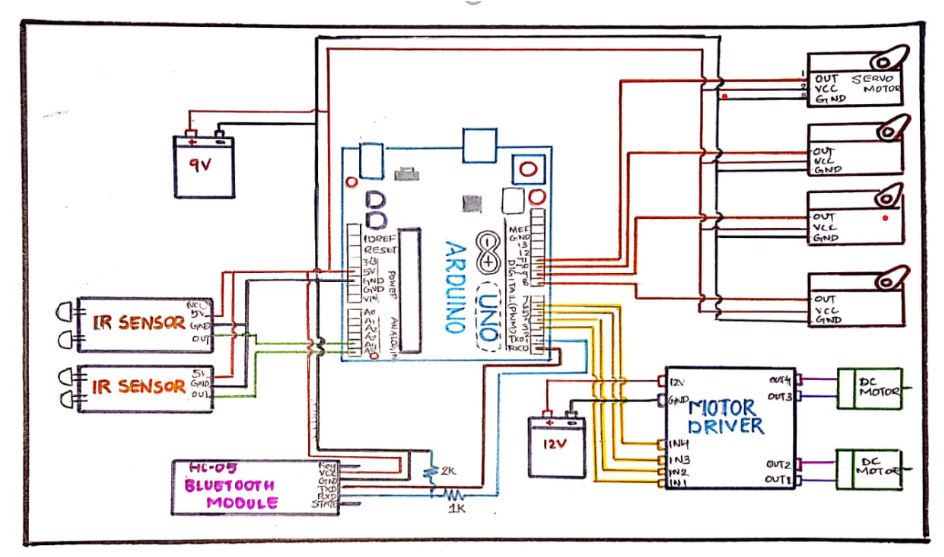

# **Industrial Robot - Pick and Place Line Follower**

## **Overview**
This project focuses on the development of an **Industrial Robot** that combines a **robotic arm** with a **line follower mechanism**. The robot can autonomously pick up objects from one location and place them at another while following a predefined path.

## **Features**
- **Line Follower Mechanism:** Uses **IR sensors** to detect and follow a path.
- **Robotic Arm:** Controlled using **Arduino Uno** and **servo motors** to pick and place objects.
- **Bluetooth Control:** The arm can be controlled remotely via an **Android application**.
- **Automated Movement:** Reduces manual labor and enhances industrial automation.

---

## **Block Diagram**

---

## **Circuit Diagram**

---

## **Components Used**
### **Main Components**
1. **Arduino Uno** - Microcontroller unit for processing commands.
2. **Bluetooth Module (HC-05)** - Enables wireless control via mobile.
3. **Servo Motors (MG996R, SG90)** - Used for robotic arm movement.
4. **IR Sensors** - Detect the path for movement.
5. **DC Motors** - Drive the robot forward.
6. **Motor Driver (L298)** - Controls motor speed and direction.
7. **Power Supply (9V, 12V Batteries)** - Provides required power for components.

### **Additional Components**
- Resistors (1K, 2K)
- Nuts & Bolts
- Caster Wheels
- Frame

---

## **Working Principle**
1. The **IR sensors** detect the path and guide the robot along the predefined track.
2. The **robotic arm** picks up objects based on commands sent from the **Arduino Uno**.
3. The **Bluetooth module** allows remote control of the arm via a mobile app.
4. The **motor driver and DC motors** enable movement along the track.
5. The **servo motors** adjust the arm’s position for picking and placing objects.

---

## **Installation & Usage**
1. **Power the Circuit**: Connect the **9V and 12V batteries**.
2. **Control the Robot**:
   - The robot follows a predefined **line** automatically.
   - Use the **Android app** to control the arm remotely.
3. **Pick & Place Function**:
   - The robotic arm picks up objects from a defined location.
   - Moves to the next predefined location and releases the object.

---

## **Applications**
- **Industrial Automation**: Replaces human labor for material transportation.
- **Supermarkets & Warehouses**: Can be used for automated product handling.
- **Libraries**: Helps in book arrangement and management.
- **Healthcare**: Can assist in carrying medical supplies.

---

## **Future Enhancements**
- Implementing **obstacle detection** for smoother movement.
- Adding **AI-based decision making** to optimize path following.
- Increasing **load capacity** and efficiency for industrial use.

---

